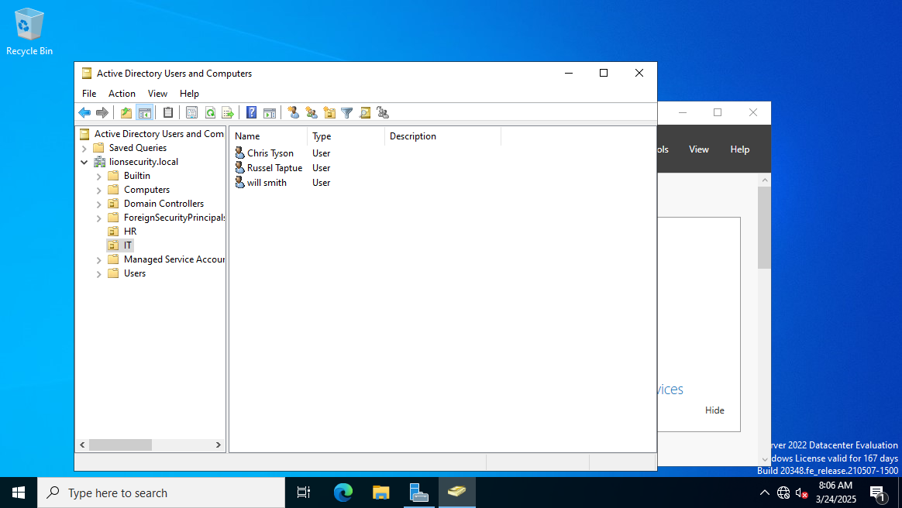

# Projet Active Directory et Monitoring SIEM avec Splunk

## Sommaire
- [Description et Objectif](#description-et-objectif)
- [Architecture](#architecture)
- [Installation](#installation)
  - [Installation et Configuration d'Active Directory](#1-installation-et-configuration-dactive-directory)
  - [Installation de Splunk](#2-installation-de-splunk)
  - [Installation de Sysmon](#3-installation-de-sysmon)
  - [Configuration du Monitoring SIEM](#4-configuration-du-monitoring-siem)
- [Captures d'écran](#captures-decran)
- [Conclusion](#conclusion)

## Description et Objectif
Ce projet vise à mettre en place une infrastructure Active Directory (AD) tout en intégrant une solution de monitoring basée sur Splunk pour assurer une surveillance efficace des activités réseau et des événements de sécurité. L'objectif principal est d'améliorer la visibilité sur les logs d'authentification, les accès aux ressources et les tentatives de compromission, permettant ainsi une réponse rapide aux incidents de sécurité.

## Architecture
L'architecture du projet repose sur les composants suivants :
- **Active Directory (AD)** : Gestion centralisée des utilisateurs, des groupes et des politiques de sécurité.
- **Windows Server (Contrôleur de domaine)** : Serveur principal assurant l'authentification et la gestion des objets AD.
- **Clients Windows** : Machines connectées au domaine pour simuler l'utilisation réelle.
- **Splunk Enterprise** : Plateforme de collecte, d'analyse et de visualisation des logs.
- **Universal Forwarder** : Agent installé sur les machines pour envoyer les logs vers Splunk.
- **Security Information and Event Management (SIEM)** : Détection et réponse aux incidents à partir des logs collectés.
- **Sysmon** : Outil permettant d'améliorer la collecte des événements système pour une meilleure visibilité sur les activités des machines.

## Installation
### 1. Installation et Configuration d'Active Directory
- Installation de Windows Server.
- Promotion du serveur en tant que contrôleur de domaine.
- Création des utilisateurs et groupes de test.

### 2. Installation de Splunk
- Téléchargement et installation de Splunk sur un serveur dédié.
- Configuration des sources de logs et intégration avec Active Directory.
- Installation de Splunk Universal Forwarder sur les machines clientes et le contrôleur de domaine.

### 3. Installation de Sysmon
Sysmon (System Monitor) est un utilitaire de Microsoft permettant de collecter des informations détaillées sur les événements système, ce qui est crucial pour un bon monitoring dans un environnement SIEM. Voici les étapes pour installer Sysmon :

1. Téléchargez le binaire de Sysmon depuis [le site de Microsoft Sysinternals](https://docs.microsoft.com/en-us/sysinternals/downloads/sysmon).
2. Extrayez l'archive téléchargée dans un répertoire de votre choix.
3. Ouvrez une invite de commande avec des privilèges d'administrateur.
4. Installez Sysmon en exécutant la commande suivante :
sysmon -accepteula -i sysmonconfig.xml
Où `sysmonconfig.xml` est le fichier de configuration Sysmon.

### 4. Configuration du Monitoring SIEM
- Activation des logs de sécurité sur Windows Server.
- Mise en place d'alertes pour détecter les incidents de sécurité.

## Captures d'écran
- Capture de l'ajout de windows 10 au domain d'Active Directory.

- Capture de la simulation du reseau d'entreprise dans GNS3.

## Conclusion
Ce projet permet d'établir une infrastructure sécurisée et surveillée grâce à l'intégration d'Active Directory, Splunk et Sysmon. Il offre une visibilité en temps réel sur les activités et les incidents de sécurité, facilitant ainsi la détection et la réponse aux menaces potentielles.
